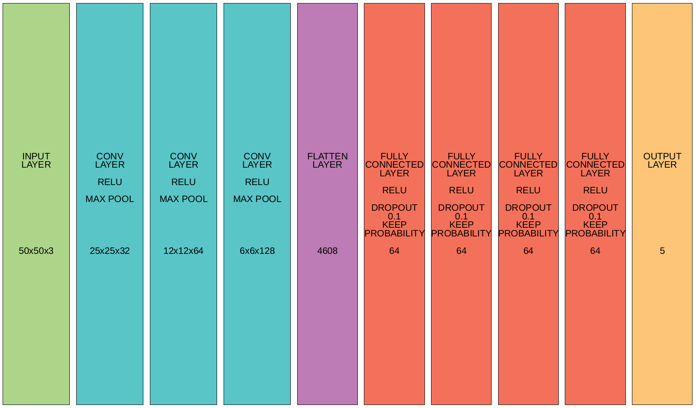

# Convolutional neural network for multiclass coin classification

### Dependencies
---
- python3
- tensorflow
- keras
- numpy
- pillow

### Classes map
---
```
{
    '10': 0, 
    '100': 1, 
    '25': 2, 
    '5': 3, 
    '50': 4
}
```
### Usage
---
```
$ python3 predict.py path1 path2 path3 ...
```

### Output
---
Space separated values from {0, 1, 2, 3, 4} in one string

### Example
---
```
$ python3 predict.py '../data/coins/test/10/10_1477185540.jpg' '../data/coins/test/25/25_1477149360.jpg'
  0 2
```

Use absolute path or path from directory from which script is ran.

### Results
---
Published model trained to 95/89% train/test accuracy

### Report
---


#### Goal
The goal was to classify coins into 5 categories, coins worth 5, 10, 25, 50 or 100 centavos, a subunit of Brazilian real.

#### Chosen method
The method chosen to achieve this goal was a neural network. This particular one is built as in the image above. Image rescale 1./255 is used so the network needs to deal only with values 0-1, instead of 0-255.

Train samples: 2014

Validation samples: 534

Test samples: 417

Accuracy: 95/89% train/test

Types of layers used:
- convolutional
  - less compute intensive layer, only the nearest inputs are taken into an output
- activation (function)
  - relu - f(x) = max(0, x), found useful with image classification 
  - softmax - squashes weights to be in range of 0-1 and scales them, so that their sum is equal to 1, which makes them a probability distibution
- max pooling
  - 2x2 used here, takes a max value from 2x2 square and outputs it 
- flattening
- dense (or fully connected)
- dropout
  - used to reduce overfitting, which occurs when e.g. train sample is small. Thanks to this layer some neurons, chosen at random, are being ignored during training, which prevents dense layers build co-dependencies between neurons.


### Footnotes
---
MONEDA, L. (2016) Brazilian Coins Dataset. Retrieved from: [http://lgmoneda.github.io/](http://lgmoneda.github.io/)
