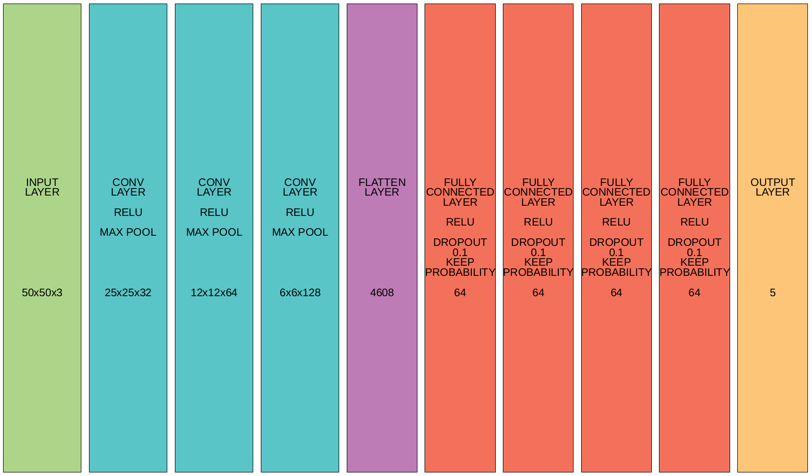

# Convolutional neural network for multiclass coin classification

#### Dependencies
---
- python3
- tensorflow
- keras
- numpy

#### Classes map
---
```
{
    '10': 0, 
    '100': 1, 
    '25': 2, 
    '5': 3, 
    '50': 4
}
```
#### Usage
---
```
$ python3 predict.py path1 path2 path3 ...
```

#### Output
---
Space separated values from {0, 1, 2, 3, 4} in one string

#### Example
---
```
$ python3 predict.py '../data/coins/test/10/10_1477185540.jpg' '../data/coins/test/25/25_1477149360.jpg'
  0 2
```

Use absolute path or path from directory from which script is ran.

#### Results
---
Published model trained to 95/89% train/test accuracy

#### Report
---


TODO


#### Footnotes
---
MONEDA, L. (2016) Brazilian Coins Dataset. Retrieved from: [http://lgmoneda.github.io/](http://lgmoneda.github.io/)